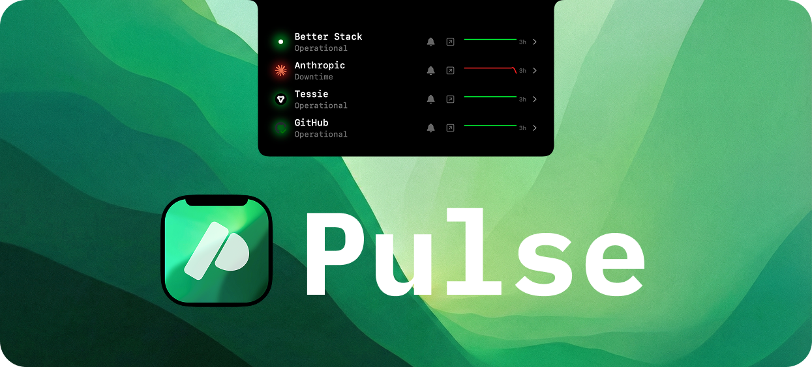

  

    A beautiful, non-intrusive service monitor that lives in your notch. Supports Better Stack, Atlassian Statuspage, and custom HTTP health checks

  <a href="https://jsattler.github.io/Pulse">Website</a> ·
  <a href="#installation">Installation</a> ·
  <a href="#features">Features</a> ·
  <a href="#contributing">Contributing</a>

## Features

- **Notch integration**: Color-coded glow around your MacBook notch — green for all clear, yellow for degraded, red for outage
- **Live hover overlay**: Hover over the notch to see an animated panel with live status for every monitored service
- **Multiple providers**: Supports Better Stack, Atlassian Statuspage, and custom HTTP health checks
- **Config file driven**: Define all monitors in `~/.config/pulse/config.json` with live hot-reload
- **Smart notifications**: Alerts on state transitions only, with per-service silence and snooze
- **Privacy-focused**: No tracking, no analytics — all data stays on your machine

## Installation

### Direct Download

Download the latest release from [GitHub Releases](https://github.com/jsattler/Pulse/releases/latest) and open `Pulse.dmg`.

**Requirements**: macOS 15.0 (Sequoia) or later

## Supported Status Providers

| Provider             | Status    |
| -------------------- | --------- |
| HTTP health checks   | Available |
| Better Stack         | Available |
| Atlassian Statuspage | Available |
| TCP connectivity     | Planned   |
| incident.io          | Planned   |
| Status.io            | Planned   |

## Contributing

We welcome contributions of all kinds!

**Note**: Any issues or pull requests for feature requests submitted without prior discussion will be closed immediately.

## Acknowledgments

Special thanks to these projects for their excellent work and inspiration:

- [**claude-island**](https://github.com/farouqaldori/claude-island) — notch island design
- [**textream**](https://github.com/f/textream) — notch island design

## License

This project is licensed under the MIT License - see the [LICENSE](LICENSE) file for details.
